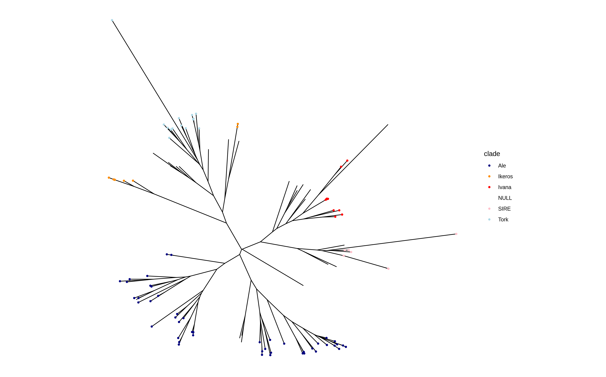

# volcano_LTR
The pipeline to characterize the LTR-RTs family, classify and predict the burst families.

To run volcano-pipeline, you need the result of [`LTR retriver`](https://github.com/oushujun/LTR_retriever) or [`EDTA`](https://github.com/oushujun/EDTA).


## Installation

We recommend installing dependence with `conda`

```shell
conda env create -f volcano.yml
```

Then

```shell
git clone https://github.com/Suosihe/volcano_LTR.git
cd /path/to/volcano
chmod a+x prepare.sh volcano.sh tel.sh scripts/*
export PATH=/path/to/volcano
export PATH=/path/to/volcano/scripts
```

The dependence contains:

`perl >= 5.0`​

Categorical dependence: `samtools`,`RepeatMasker`​,`blast`​,`fasttree`,`cd-hit`,`mafft`​

Quantitative dependence:`telescope`,`r-optparse`,`r-readr`,`r-dplyr`

`R >= 4.0`​


## Usage

You need the `LTR retriver` results to run the `volcano` pipeline. If you run `EDTA`, you may found the input files in `*mod.EDTA.raw/LTR/`. To get more details for input-file-preparation, you can see [Wiki](https://github.com/Suosihe/volcano_LTR/wiki).

### Classification

```
volcano.sh
Usage: volcano.sh
                   Required parameters:
               [-l reference.fa.pass.list] [-f reference.fa]
               [-n prefix] [-s genome_size_bp_file]
                   Optional parameters:
               [-c sequence identity threshold for cd-hit] default 0.8
               [-L alignment coverage for the longer sequence in cd-hit], default 0.8
               [-T threads for cd-hit] default 0, use all CPUs
               [-M memory limit (in MB) for cd-hit] default 0 for no limit
               [-p parallel number for RepeatMasker] default 80
               [-v 'div' in RepeatMasker] Masks only those repeats with (number) percent diverged from consensus, default 40
```

Using the volcano.sh script, four input files are essential.

`-l` option is the result of `LTR_retriver` (in `EDTA`) and ends with `pass.list`.

`-f` option is the reference genome, which usually ends in mod if you are using `EDTA` as an input file.

`-n` option is the prefix you defined.

`-s` option is the genome size file. It only contains the length number of the genome.

The optional parameters：

`-c` sequence identity threshold for cd-hit default 0.8

`-L` alignment coverage for the longer sequence in cd-hit, default 0.8

`-T` threads for cd-hit default 0, use all CPUs

`-M` memory limit (in MB) for cd-hit default 0 for no limit

`-p` parallel number for RepeatMasker default 80

`-v` 'div' in RepeatMasker Masks only those repeats with (number) percent diverged from consensus, default 40

If you want to prepare the input files more conveniently, you may visit [Wiki](https://github.com/Suosihe/volcano_LTR/wiki).

By default, the log will be output on the screen.


### Quantification

```
tel.sh
Usage: tel.sh     Required parameters:
               [-g pass.list.gff3]  [-s sorted.sam]  [-p prefix]  [-n number]

* [pass.list.gff3] must be defined in the script. It is in your LTR_retriver path or [EDTA.raw/LTR/]. 

* [sorted.sam] must be defined in the script. It is a sorted sam file usually contains alignment results. 

* [prefix] must be defined in the script. It is the prefix you defined for your output. 

* [number, genome_size_bp] must be defined in the script. It is a file which only contains genome size (bp) number. It can be got from index file. 

* -h, --help: print this help and exit
```


Find `*pass.list.gff3` in `EDTA_raw/LTR` directory or `*pass.list.gff3` in `LTR retriever` directory.

The `*sorted.sam` file is obtained by comparing the RNA-seq file with the reference genome. If you are unsure about the file, you can refer to the [Wiki](https://github.com/Suosihe/volcano_LTR/wiki). 

`-p` option is a prefix for the results file.

`-n` option is the genome size file.

## test

```shell
cd /your/path/to/volcano/test_data
volcano.sh -l test.pass.list -f test.fasta -n test -s test_len &> vol_test.log
samtools view -O SAM -o test.st.sam test.st.bam
tel.sh -g test.pass.list.gff3 -s test.st.sam -p test -n test_len &> tel_test.log
```

Test data is from [*Scaevola taccada* genome](https://www.nature.com/articles/s41467-023-40002-9).

## Output

### Classification

`prefix_clust.out.clstr.list` file shows the clustering results.

`prefix_gypsy.rt.tree` and `prefix_copia.rt.tree` show the final trees with marker LTR-RTs. 

`prefix_fam_coverage.info` file shows the details of the LTR-RTs in each clusters. Each column is described as below.

| Column name             | Data type| Description                                                                                   | Example data                           |
|-------------------------|----------|-----------------------------------------------------------------------------------------------|----------------------------------------|
| RepeatMasker_entry      | String   | Name of the transposable element (TE).                                                        | NC_057761.1:45752..55570_LTR#LTR/Copia |
| TE_family               | String   | Name of the transposable element family.                                                      | NC_057761.1:45752..55570_LTR           |
| Full_length             | Integer  | Number of full-length copies.                                                                 | 192                                    |
| Left_end_only           | Integer  | Number of left-end-only copies.                                                               | 68                                     |
| Right_end_only          | Integer  | Number of right-end-only copies.                                                              | 9                                      |
| Converted_copy_number   | Integer  | The converted copy number, calculated as: full-length + (left-end-only + right-end-only) / 2. | 231                                    |
| Total_entries           | Integer  | The total number of entries in this transposable element family.                              | 270                                    |
| Total_length_in_bp      | Integer  | The total length of all entries in this transposable element family (in base pairs, bp).      | 58442                                  |
| Whole_genome_percentage | Float    | The percentage of the transposon family relative to the entire genome.                        | 0.01354                                |
| Subclass                | String   | The subclass of the transposon, such as Copia or Gypsy.                                       | Copia                                  |
| NUM                     | Integer  | The number of sequences in each evolutionary branch (clade).                                  | 37                                     |
| ID                      | Integer  | The unique identifier for each family.                                                        | 1002                                   |
| Clade                   | String   | The name of the evolutionary branch, such as SIRE, Tork, etc.                                 | Tork_Ty1                               |

### Quantification

`prefix_RPKM.tsv` file shows the RPKM results of each intact LTR-RT.

`prefix_tel-telescope_report.tsv` file shows a statistical report of the run containing model parameters and additional information.

## Visualization

In `/your/path/to/volcano_LTR/scripts/`, the `clade_plot.R` can help you make tree plots about LTR-RT:

```shell
Rscripts clade_plot.R prefix_copia.rt.tree prefix_copia_clade.tsv prefix.copia.png
Rscripts clade_plot.R prefix_gypsy.rt.tree prefix_gypsy_clade.tsv prefix.gypsy.png
```




## Reference

[CD-HIT](http://cd-hit.org) 

> "Cd-hit: a fast program for clustering and comparing large sets of protein or nucleotide sequences", Weizhong Li & Adam Godzik. *Bioinformatics*, (2006) 22:1658-9.
>
> Limin Fu, Beifang Niu, Zhengwei Zhu, Sitao Wu and Weizhong Li, CD-HIT: accelerated for clustering the next generation sequencing data. *Bioinformatics*, (2012), 28 (23): 3150-3152. doi: 10.1093/bioinformatics/bts565.

[RepeatMasker](https://github.com/rmhubley/RepeatMasker)

> Smit, AFA, Hubley, R. & Green, P "RepeatMasker" at http://www.repeatmasker.org

[SAMtools](https://github.com/samtools/samtools)

> Petr Danecek, James K Bonfield, Jennifer Liddle, John Marshall, Valeriu Ohan, Martin O Pollard, Andrew Whitwham, Thomas Keane, Shane A McCarthy, Robert M Davies, Heng Li, Twelve years of SAMtools and BCFtools, *GigaScience*, Volume 10, Issue 2, February 2021, giab008, doi:10.1093/gigascience/giab008

[Telescope](https://github.com/mlbendall/telescope)

> Bendall ML, de Mulder M, Iñiguez LP, Lecanda-Sánchez A, Pérez-Losada M, et al. (2019) Telescope: Characterization of the retrotranscriptome by accurate estimation of transposable element expression. *PLOS Computational Biology* 15(9): e1006453. doi:10.1371/journal.pcbi.1006453

[FastTree2](http://meta.microbesonline.org/fasttree)

> Price, M.N., Dehal, P.S., and Arkin, A.P. (2010) FastTree 2 -- Approximately Maximum-Likelihood Trees for Large Alignments. *PLoS ONE*, 5(3):e9490. doi:10.1371/journal.pone.0009490.
